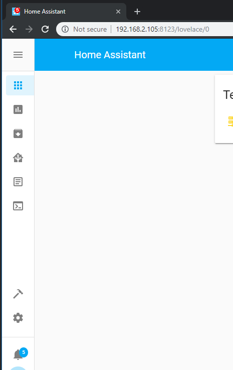
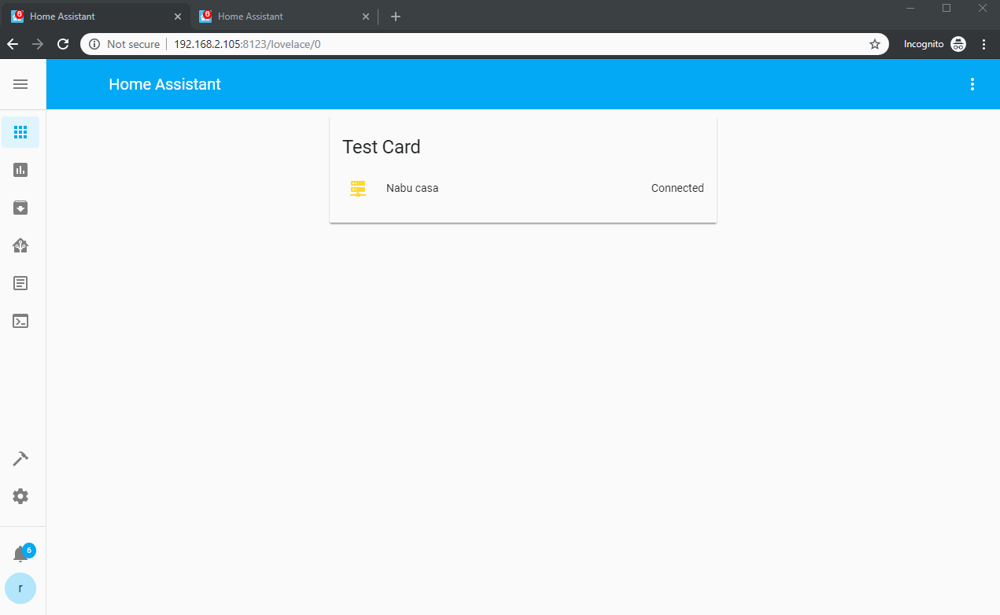

# Favicon counter

Show a counter for your pending notifications as a bage on the favicon.



## Installation

If you use []() it's there.

if not, download the `favicon-counter.js` from this repo, and place it underyou `www` folder with all other lovelace plugins.

## Configuration

```
resources:
  - url: /community_plugin/favicon-counter/favicon-counter.js
    type: js
```

## Demo




### Notes

- It's not perfect.
- It _may_ contain bugs.
- It's probably the wrong way to do it.
- But hey! it's something :D
